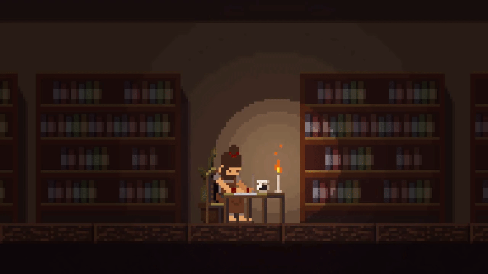

---
<h3 align="center"> what we do ?</h3>

 Leaning towrads creativity, handling data, training model and devloping artifical intellegence here creating somethinggg upppp and downn !

ㅤㅤ
<h4 align="center"> My Tech Stack </h4>

  

  
  
  
  
  
  

ㅤㅤ
<h4 align="center"> The Darts </h4>

- [x] Genaxis Lifescience Prototype 
- [ ] Genaxis Lifescience Product Launch

- [ ] Enhanced Contextual Heuristic Oracle
- [ ] Just a rather very intelligent system  

ㅤㅤ
<h4 align="center"> Open to Freelance and Contracts  |  Explore my work as you go down </h4>

<!-- <h4 align="center"> discover more of me as you go down  </h4> --!

