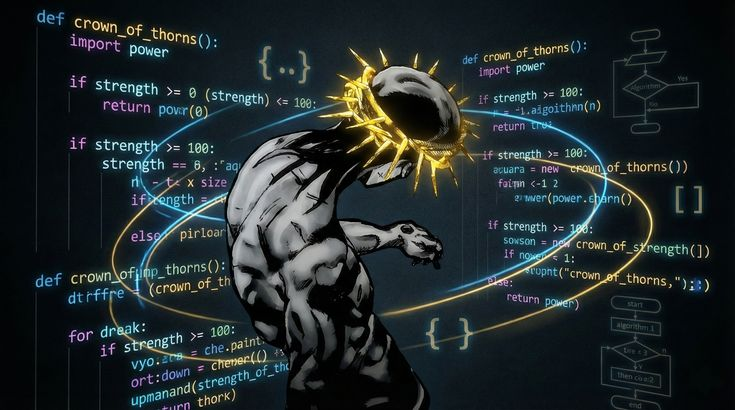

<h3 align="center"> who is ahwan ?</h3>
---

 ahwan is a nerd here creating somethinggg upppp and downn !

  Your content here

## 🚀 My Tech Stack

## 🚀 My Tech Stack

   
  

## 🚀 My Tech Stack

<!-- Row 1 -->
 

<!-- Row 2 -->

